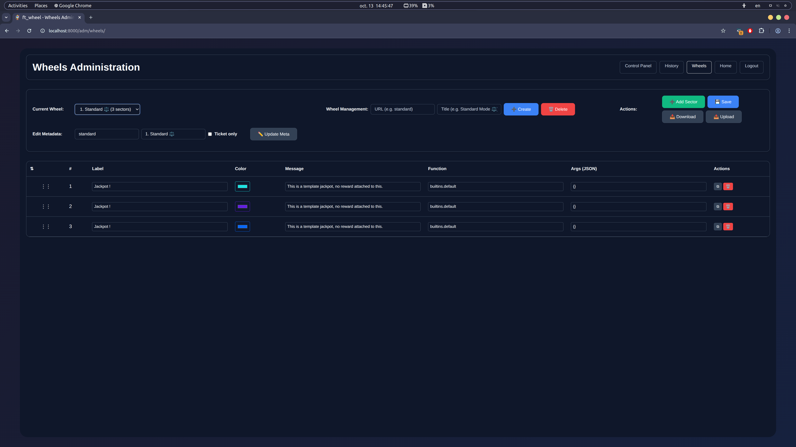

# Administration Guide

This document provides administrators with essential information for managing the ft_wheel application, including user roles, system controls, and operational procedures.

## Access Control System

### User Roles

The application uses a hierarchical role system with three access levels:


| Role          | Access Level   | Primary Functions                                      |
| --------------- | ---------------- | -------------------------------------------------------- |
| **User**      | Standard       | Wheel spinning, personal history viewing               |
| **Moderator** | Administrative | History management, ticket granting, system monitoring |
| **Admin**     | Full Control   | Wheel configuration, system settings, user management  |

### Permission Matrix


| Function                      | User | Moderator | Admin |
| ------------------------------- | ------ | ----------- | ------- |
| Spin wheels                   | Yes  | Yes       | Yes   |
| View personal history         | Yes  | Yes       | Yes   |
| Access history administration | No   | Yes       | Yes   |
| Access control panel          | No   | Yes       | Yes   |
| Grant spin tickets            | No   | Yes       | Yes   |
| Bypass maintenance mode       | No   | Yes       | Yes   |
| Configure wheels              | No   | No        | Yes   |
| Access Django admin           | No   | No        | Yes   |
| Modify system settings        | No   | No        | Yes   |

**Recovery Note:** In case of lost admin access, roles can be manually restored through direct database access. See [ADVANCED_CONFIGURATION](./ADVANCED_CONFIGURATION.md) for emergency procedures.

## System Management

### Maintenance Mode

Control application availability during updates or maintenance:

- **Activation:** Through Control Panel by admin users
- **Effect:** Regular users see maintenance message; moderators and admins retain access
- **Use Cases:** System updates, configuration changes, troubleshooting

### Monitoring and Diagnostics

The application generates comprehensive logs for different operational areas:

#### Jackpot Operations

Monitor reward processing and API interactions:

```bash
docker exec -it ft_wheel-backend-1 tail -f /var/log/ft_wheel/jackpots_info.log
docker exec -it ft_wheel-backend-1 tail -f /var/log/ft_wheel/jackpots_error.log
```

#### Administrative Actions

Track admin and moderator activities:

```bash
docker exec -it ft_wheel-backend-1 tail -f /var/log/ft_wheel/admin_info.log
docker exec -it ft_wheel-backend-1 tail -f /var/log/ft_wheel/admin_error.log
```

#### Application Logs

View complete system output:

```bash
make logs
```

## Wheel Administration

### Configuration Management

Administrators can manage wheel configurations through the dedicated administration interface:

- **Create:** Design new wheels with custom segments and rewards
- **Edit:** Modify existing wheel parameters and reward functions
- **Delete:** Remove wheels from the system
- **Synchronization:** Changes automatically propagate to connected clients

**Warning: Deleting a wheel will also remove all associated tickets.**



### Reward Functions

The system supports various reward types including titles, coalition points, and community service assignments. For detailed reward configuration, consult [REWARDS_OPTIONS](./REWARDS_OPTIONS.md).

## History Management

### Overview and Filtering

The history administration panel provides comprehensive tracking of all wheel spins:

- **Filtering:** By user, wheel type, date range, and status
- **Validation:** Moderator marking system for entry verification
- **Deletion:** Admin-only removal for abuse cases or errors


### Entry Management

**Validation Process:**

- Moderators can mark entries as valid or invalid
- Multiple moderators can review the same entry
- Maintains audit trail for administrative decisions

**Deletion Policy:**

- Admin-exclusive function
- Irreversible operation requiring careful consideration
- Built-in reward functions support cancellation through entry deletion

## Ticket System

### Ticket Administration

Tickets are used to replace the traditional cooldown system and manage access to restricted wheels.

A ticket is linked to a specific user and wheel, allowing controlled access based on administrative decisions (there is also a jackpots which can provide tickets).

Manage access to premium or restricted wheels:

- **Granting:** Assign tickets to specific users for designated wheels
- **Monitoring:** Track ticket usage and status
- **Management:** View and delete tickets as needed (Django Admin Panel only)


### Operational Notes

- Tickets cannot be deleted once created except through Django Admin Panel
- Support for both wheel-specific and general-purpose tickets
- Automatic consumption upon wheel spin

## System Configuration

### Global Settings

Configure system-wide parameters through the Control Panel:


| Setting              | Function                   | Access Level |
| ---------------------- | ---------------------------- | -------------- |
| Maintenance Mode     | Enable/disable user access | Admin        |
| Jackpot Cooldown     | Default spin interval      | Admin        |
| Announcement Message | Homepage banner text       | Admin        |

### User Management

Administrative control over user accounts and permissions:

- **Role Assignment:** Promote or demote users through Django Admin Panel
- **Account Management:** Modify user properties and access levels
- **Emergency Access:** Direct database modification for role recovery

## Best Practices

### Security Guidelines

- Regularly review user permissions and role assignments
- Monitor administrative logs for unusual activity
- Use maintenance mode during sensitive operations
- Maintain current backups of configuration files

### Operational Procedures

- Test wheel configurations in controlled environment before deployment
- Document significant system changes in patch notes
- Coordinate maintenance windows with user base
- Validate reward function configurations before activation

## Troubleshooting

### Common Issues

1. **Permission Denied Errors**

   - Verify user role assignments
   - Check middleware configuration
   - Confirm proper authentication
2. **Wheel Configuration Problems**

   - Validate JSON syntax in configuration files
   - Verify reward function parameters
   - Check for conflicting wheel identifiers
3. **Logging Issues**

   - Ensure proper volume mounting for log files
   - Verify log rotation settings
   - Check disk space availability

For advanced configuration topics and emergency procedures, refer to [ADVANCED_CONFIGURATION](./ADVANCED_CONFIGURATION.md).

## Next Steps

For Rewards options, refer to [REWARDS_OPTIONS](./REWARDS_OPTIONS.md).
