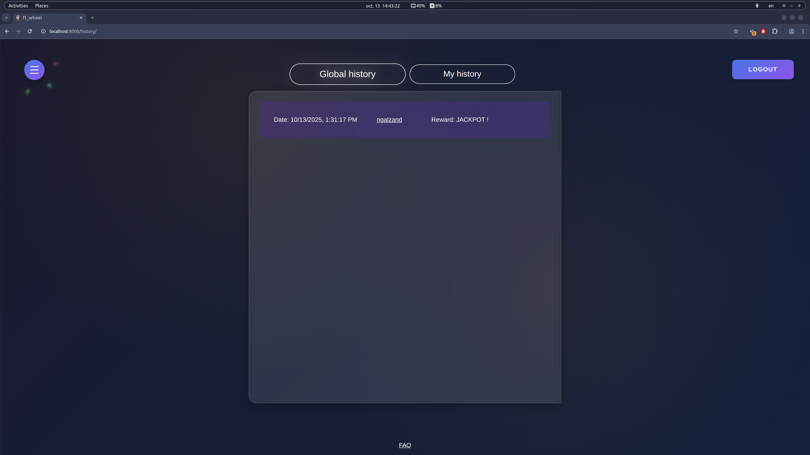
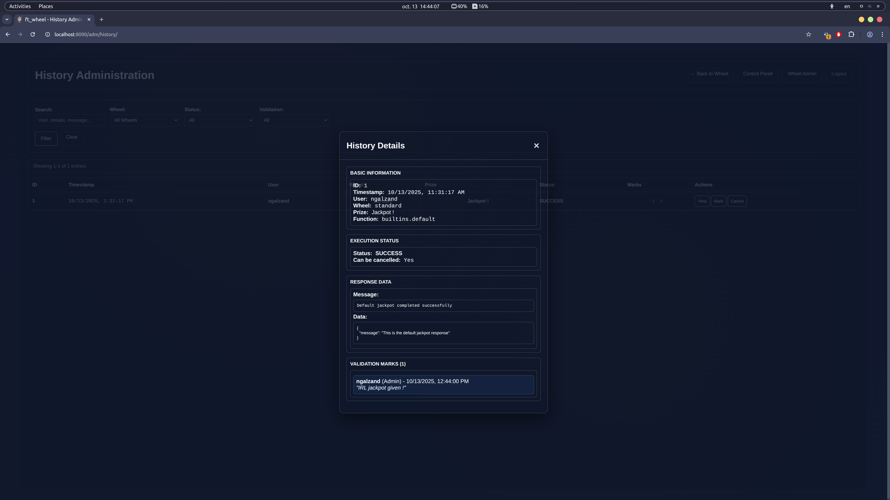
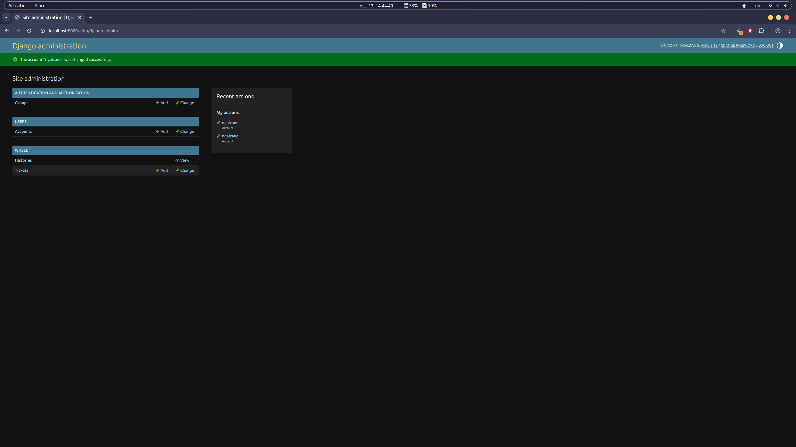

# 🎡 FT_WHEEL

**May the luck be with you.**

## Overview

**FT_WHEEL** is a fully customizable and real-time “Wheel of Fortune”-style web application designed for **42 campuses** .

It integrates seamlessly with the **42 Intra API** and provides an engaging gamified experience where students can spin the wheel to win various prizes — such as coalition points, wallet bonuses, or custom rewards.

Built on **Django 5.2** , FT_WHEEL includes a powerful administration interface, dynamic configuration options, and a modular API for extending the game’s logic.

## 📊 Some statistics

Tested on 2 piscines (around 110 persons per piscine) at 42 Mulhouse. The wheel, only accessible by pisciners, **has been spinned over 1400 times** (with a cooldown of 24hours) which proved the potential of the project. (160 hours of TIGs btw). Note that the wheel have been up for less than 3 weeks per piscine.

## 🚀 Key Features

* **42 OAuth2 Authentication** — Secure user login and state management using the official 42 API.
* **Fully Customizable Wheels** — Define and manage wheel configurations through simple JSON files or from the "wheel admin pannel".
* **Real-Time Administration** — Enable maintenance mode, edit announcement banner, edit spin cooldown, ...
* **Automatic Reward Handling** — Prizes can trigger built-in or custom reward actions (coalition points, wallets, etc.) and support logical rollbacks.
* **Detailed History & Auditing** — View spin logs, cancel rewards, and track admin actions with automatic logging.
* **Modular Extensibility** — Easily add your own features via `api/builtins` or `api/mods`.
* **Dockerized Infrastructure** — Production-ready setup with PostgreSQL, Daphne (ASGI), and persistent admin logs. All you have to do is to add a reverse-proxy for HTTPS.

## Summary

1. [Basic installation](./BASIC_INSTALLATION.md)
2. Advanced configuration
3. Administration
4. Rewards options

## Preview

